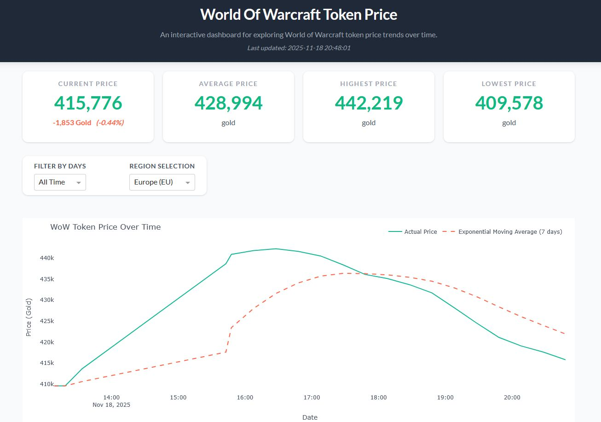

# WoW Token Price Predictor

A Python-based tool to **predict the in-game gold price of the WoW Token** in World of Warcraft using historical data and simple machine-learning/statistical approaches.

---



## Why this project

- The WoW Token allows players to exchange real money for gold (or gold for game time). The exchange rate fluctuates with in-game supply & demand, expansions, events, etc.  
- Knowing when the token is “cheap” (in gold) can help players decide whether to buy it or wait.  
- This project builds a model to **forecast future Token prices in gold**, enabling better decision-making for gold-rich or gold-poor players.

---

## Getting started

### Prerequisites

- **Python 3.10+**
- **[uv](https://docs.astral.sh/uv/)** (recommended for environment + dependency management)

---

### Setup using `uv`


# 1. Clone the repository
```bash
git clone https://github.com/Dvdandrades/WoW_Token_Price_Predictor.git
cd WoW_Token_Price_Predictor
```

# 2. Create and activate an isolated environment
```bash
uv venv
source .venv/bin/activate        # on macOS / Linux
# or
.venv\Scripts\activate           # on Windows
```

# 3. Install dependencies
```bash
uv sync