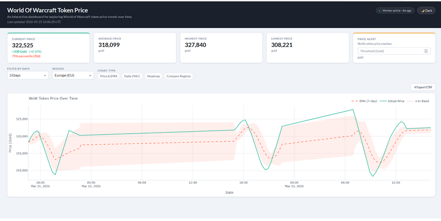

# WoW Token Price Predictor

Dashboard and background collector for tracking the World of Warcraft Token price across Blizzard regions.

The app stores token prices in SQLite, computes useful derived metrics such as EMA and price changes, and exposes an interactive Dash dashboard for exploring price history.



## Features

- Fetches WoW Token prices from the Blizzard Game Data API.
- Collects data for EU, US, KR, and TW regions.
- Stores historical prices in a local SQLite database.
- Tracks current price, average, high, low, absolute change, percentage change, and 30-day percentile.
- Shows multiple chart views:
  - Price and EMA line chart with volatility band
  - Daily OHLC candlestick chart
  - Day/hour heatmap
  - Multi-region comparison
- Includes dark mode, CSV export, price threshold alerts, worker freshness badge, and `/health` endpoint.

## Requirements

- Python 3.12+
- [uv](https://docs.astral.sh/uv/) for dependency management
- Blizzard API client credentials

Create Blizzard API credentials from the Blizzard Developer Portal, then add them to a local `.env` file.

## Setup

```bash
git clone https://github.com/Dvdandrades/WoW_Token_Price_Predictor.git
cd WoW_Token_Price_Predictor
uv sync
```

Create `.env` in the project root:

```env
CLIENT_ID=your_blizzard_client_id
CLIENT_SECRET=your_blizzard_client_secret
REGION=eu
EMA_SPAN_DAYS=7
CACHE_TIMEOUT_MINUTES=19
WORKER_INTERVAL_MINUTES=20
```

`CLIENT_ID` and `CLIENT_SECRET` are required. The other values are optional and default to the values shown above.

## Running

Start the collector in one terminal:

```bash
uv run python src/worker.py
```

The worker initializes `data/wow_token_prices.db`, fetches all configured regions immediately, then repeats every `WORKER_INTERVAL_MINUTES`.

Start the dashboard in another terminal:

```bash
uv run python src/app.py
```

Open the app at:

```text
http://127.0.0.1:8050
```

Health check:

```text
http://127.0.0.1:8050/health
```

## Configuration

| Variable | Required | Default | Description |
| --- | --- | --- | --- |
| `CLIENT_ID` | Yes | - | Blizzard OAuth client ID |
| `CLIENT_SECRET` | Yes | - | Blizzard OAuth client secret |
| `REGION` | No | `eu` | Default dashboard region |
| `EMA_SPAN_DAYS` | No | `7` | EMA span shown in the line chart |
| `CACHE_TIMEOUT_MINUTES` | No | `19` | Dashboard cache timeout |
| `WORKER_INTERVAL_MINUTES` | No | `20` | Background collection interval |

Supported regions are `eu`, `us`, `kr`, and `tw`.

## Data Files

Runtime files are created under `data/`:

- `wow_token_prices.db`: SQLite database with historical token prices.
- `token_cache_<region>.json`: cached OAuth tokens for each region.

These files are generated locally and should not be committed.

## Development

Run the test suite:

```bash
uv run pytest
```

Run linting:

```bash
uv run ruff check .
```

## Project Structure

```text
src/
  api_client.py   Blizzard OAuth and token price client
  app.py          Dash app and Flask server
  callbacks.py    Dashboard callbacks
  config.py       Environment settings and constants
  db_reader.py    SQLite read/query helpers
  db_writer.py    SQLite initialization and inserts
  figures.py      Plotly figure builders
  layout.py       Dash layout
  worker.py       Scheduled background collector
tests/            Pytest suite
assets/           Dashboard image and CSS
```

## Notes

The project name keeps "Predictor", but the current application is primarily a historical tracking and analysis dashboard. EMA, percentile, OHLC, and heatmap views help interpret pricing trends; they are not a full forecasting model yet.
